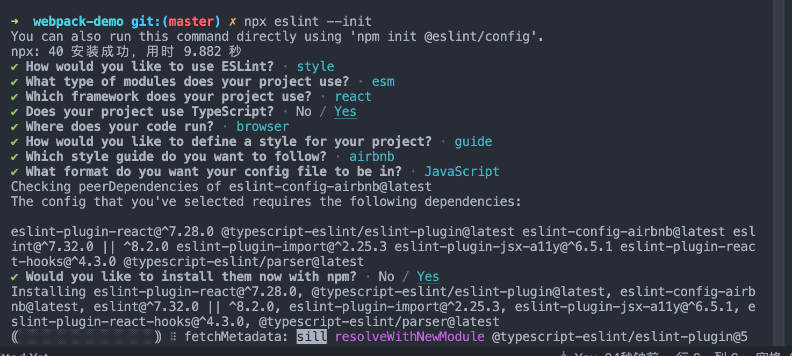

# 工程化

> webpack是基于JavaScript开发的前端打包构建框架，通过依赖收集，模块解析，生成chunk,最终输出生成的打包产物。
## webpack5
1. `loader`: 处理其他类型(除了js，json)的文件，并将他们转换成有效的模块，以供应用程序使用，以及添加到依赖图中
2. `plugins`: 解决 loader 无法实现的其他事
3. react plus typescript
```js
// 用到的库
@babel/preset-typescript @babel-preset-env @babel-react @types/react @types/react-dom
```
4. react plus eslint 校验
* 安装

```js
npm i eslint --save-dev

```
* 初始化文件
```js
npx eslint --init // 进入问题配置页面
```


* 安装`npm install eslint-webpack-plugin --save-dev`
```js
// 注意保证：eslint >= 7
const ESLintPlugin = require('eslint-webpack-plugin');
module.exports = {
  // ...
  plugins: [
    new ESLintPlugin({
      // 指定需要检查的扩展名
      extensions: ['js', 'tsx', 'ts', 'jsx'],
      // 启用 Eslint 自动修复特性
      fix: true
    }),
  ],
  // ...
};
```
* 安装的其他库：

```js
//  error  Definition for rule 'prettier/prettier' was not found
prettier eslint-config-prettier eslint-plugin-prettier prettier

// error  Missing file extension for "@/container/App" 
1. 安装： eslint-import-resolver-typescript
2. 在settings中配置
"settings": {
    "import/resolver": {
        "typescript": {}
    }
}
3. 在rules中配置
"import/extensions": [
    "error",
    "ignorePackages",
    {
        "ts": "never",
        "tsx": "never"
    }
]
```
5. 生产环境打包：`Error: You forgot to add 'mini-css-extract-plugin'`

> 原因：`speed-measure-webpack-plugin` 不能和上面插件同时用,需要降级处理`^2.6.0` -> `^1.3.6`

6. webpack5,内置了`file-loader`和`url-loader`，可以不用安装
    * `asset/resource` 将资源分割为单独的文件，并导出url,类似之前的file-loader的功能
    * `asset/inline` 将资源导出dataUrl的形式，类似之前的url-loader的小于limit参数时的功能
    * `asset/source` 将资源导出为源码，类似于raw-loader功能
    * `asset` 会根据文件大小来选择使用哪种类型，当文件小于8KB(默认)的时候会使用asset/inlinem,否则使用asset/resource

### 优化构建速度
1. 构建费时分析：`speed-measure-webpack-plugin`
2. 优化`resolve`配置：配置`alias（别名）`、`extension(文件扩展名)`、`modules(告诉webpack解析模块时应该搜索的目录)`
3. 缩小范围：配置loader时，指定`include`和`exclude`
4. noParse: 不需要解析依赖的第三方类库等，可以通过这个字段进行配置
```js
module.exports = {
  module: {
    noParse: /jquery|lodash/,
    rules: [
      ...
    ]
  }
}
```
5. IgnorePlugin: 防止在`import`和`require`调用时，生成以下正则表达式匹配的模块
```js
const webpack = require('webpack')
modules.exports = {
  plugins: [
    // 目的是将插件中的非中文语言排除掉
    new webpack.IgnorePlugin({
      // 匹配资源请求路径的正则表达式
      resourceRegExp: /^\.\/locale$/,
      // 匹配资源上下文的正则表达式
      contextRegExp: /moment$/
    })
  ]
}
```
6. 多进程配置：`thread-loader`

> 配置在`thread-loader` 之后的loader都会在一个单独的worker池中运行

7. 利用缓存
  * `babel-loader` 开启缓存

  ```js
  // babel在转译js过程中时间开销比较大，将babel-loader的执行结果缓存起来，重新打包的时候，直接读取缓存
  // 缓存位置：`node_modules/.cache/babel-loader`
    {
      loader: 'babel-loader',
      options: {
        cacheDirectory: true
      }
    }
  ```

  ### 优化构建结果
  1. 结果分析插件：`webpack-bundle-analyzer`
  2. 压缩CSS, 单独提取CSS
  3. 压缩JS:`terser-webpack-plugin`, webpack5已经内置
  4. 清除无用的css:`purgecss-webpack-plugin`: 注释掉的代码还是会打包进去的
  5. Tree-shaking: 剔除没有使用的代码
    * webpack默认支持，需要在`.babelrc`里面设置：`modules: false`,即可在生产环境默认开启
  6. Scope Hoisting:即作用域提升，原理是将多个模块放在同一个作用域下，并重命名防止命名冲突，通过这种方式可以减少函数声明和内存开销
    * webpack 默认支持，在生产环境下默认开启
  7. 优化运行时体验：按需加载
  8. splitChunks分包配置
    * 默认情况下，它只会影响到按需加载的chunks，因为修改initial chunks 会影响到项目的HTMl文件中的脚本标签。
    * webpack会根据一下条件自动拆分chunks:
      * 新的chunk 可以被共享，或者模块来自`node_modules`文件夹
      * 新的chunk体积大于20Kb
      * 当按需加载chunks时并行请求的最大数量小于或者等于30
      * 当加载初始化页面时，并行请求的最大数量小于或等于30 


# webpack 构建流程
* 初始化参数：从配置文件和Shell语句中读取与合并参数，得出最终的参数
* 开始编译：用上一步得到的参数初始化Compiler对象，加载所有配置的插件，执行对象的run方法开始执行编译
* 确定入口：根据配置中的entry找出所有的入口文件
* 编译模块：从入口文件触发，调用所有配置的Loader对模块进行翻译，再找出该模块依赖的模块，再递归本步骤直到所有入口依赖的文件都经过了本步骤的处理
* 完成模块编译：在经过第4步使用 Loader 翻译完所有模块后，得到了每个模块被翻译后的最终内容以及它们之间的依赖关系
* 输出资源：根据入口和模块之间的依赖关系，组装成一个个包含多个模块的 Chunk，再把每个 Chunk 转换成一个单独的文件>加入到输出列表，这步是可以修改输出内容的最后机会
* 输出完成：在确定好输出内容后，根据配置确定输出的路径和文件名，把文件内容写入到文件系统


* 开始运行webpack
  * 读取与合并参数，加载plugin
  * 实例化 Compiler
    * 调用compiler.run创建compilation,代表一次资源的构建
    * compilation对象也提供了很多关键步骤的钩子函数，并生成一次chunk
    * compilation.buildModule主要执行loader，编译掉不认识的代码
* 使用Parser分析项目依赖
  * 从chunk开始解析依赖，使用Module和Dependency管理代码模块相互关系
* 使用Template生成结果代码
  * 基于Chunk的数据拼接字符串，生成最终代码

# Loader 和 Plugin的区别
* loader 本质是一个函数，在该函数中对接收到的内容进行转换，返回转换后的结果。因为Webpack只认识JavaScript,所以Loader就成了翻译官，对其他类型的资源进行转译的预处理工作。Loader在module.rules中配置，作为模块的解析规则，类型是数组。每一项都是一个Object,内部包含test（类型文件）、loader、options(参数)等属性。
* Plugin就是插件，基于事件流框架Tapable,插件可以扩展Webpack的功能，在Webpack运行的生命周期中会广播出许多事件，Plugin可以监听这些事件，在合适的时机通过Webpack提供的API改变输出结果。Plugin在plugins中单独设置，类为数组，每一项是一个Plugin实例，参数都通过构造函数传入。


# Webpack 的热更新原理
  * Webpack 的热更新又称热替换（Hot Module Replacement），缩写为 HMR。
  * 大致是：构建bundle的时候，加入一段HTML runtime的js和一段服务器沟通的js。文件修改会触发webpack重新构建，服务器通过向浏览器发送更新消息，浏览器通过jsonp拉取更新的模块文件，jsonp回调触发模块热更新替换逻辑。
